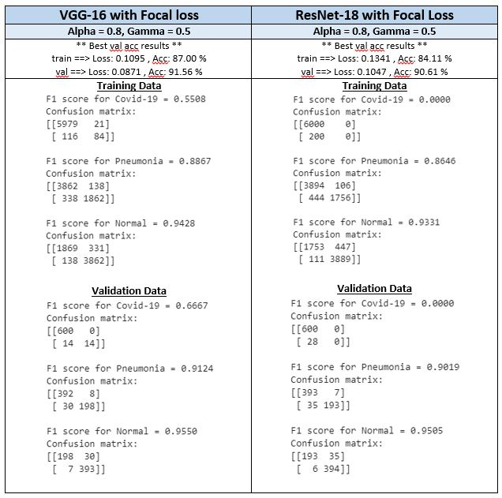

# Detecting Coronavirus Infections through Chest X-Ray images

## Decription
There are two parts of experimentation. Different Datasets were used for both experimentaion. First dataset has on two classes {Infected, Normal} while seocnd dataset has three {COVID-19, Pneumonia, Normal}. For first part only CE loss was used with softmax applied at last layer. In second part, BCE loss and Focal loss(a modified form of BCE loss to limit biasedness towards easy classes) was used.

## Dataset
* Access dataset for Part 1 from [here](https://drive.google.com/drive/folders/1P11biqCGNk5zWqILLdNkuPtbZpvXb1ay?usp=sharing).
* Access dataset for Part 2 from [here](https://drive.google.com/drive/folders/1iXz_Gb_b5SZH1b262DoL9e-g7fGgGDSu?usp=sharing).

## Description about Models used:
Two Models were used: VGG16 and ResNet18 with modiftication in Fully connected layers.

#### Fully Connected layers modified for VGG16 as:
```
    (0): Linear(in_features=25088, out_features=1060, bias=True)
    (1): ReLU(inplace=True)
    (2): Dropout(p=0.5, inplace=False)
    (3): Linear(in_features=1060, out_features=2, bias=True)
```

#### Fully Connected layers modified for ResNet18 as:
```
    (0): Linear(in_features=512, out_features=1060, bias=True)
    (1): ReLU(inplace=True)
    (2): Dropout(p=0.5, inplace=False)
    (3): Linear(in_features=1060, out_features=2, bias=True)
```

## Get Trained Models
Download trained models using following links
### For Part 1
* VGG16 Entire: [Download](https://drive.google.com/file/d/1-2MPtBDxXBEK_a1hkv-lmty0AZhOplR-/view?usp=sharing)
* ResNet18 Entire: [Download](https://drive.google.com/file/d/1-2uOOHnIDZuX8JiffRnt1XLbgMMjIFUZ/view?usp=sharing)
* VGG16 FC Only: [Download](https://drive.google.com/file/d/1hJI86eA9Sb9n0Z4hBBdRd9KsI3dZliNb/view?usp=sharing)
* ResNet18 FC Only : [Download](https://drive.google.com/file/d/1-09GoYnB8zTZMhhr1NnGbYRHza3ooX1t/view?usp=sharing)
### For Part 2
* VGG16 with Focal loss: [Download]()
* ResNet18 with Focal loss: [Download]()
* VGG16 without Focal loss: [Download]()
* ResNet18 without Focal loss: [Download]()

# Results
## Experiments on dataset for Part 1

```
** Best val acc results **
train ==> Loss: 0.2421 , Acc: 90.42 %
val ==> Loss: 0.2338 , Acc: 90.67 %
Testing Data accuracy: 96 %
```
---

```
** Best val acc results **
train ==> Loss: 0.2814 , Acc: 88.62 %
val ==> Loss: 0.2758 , Acc: 89.07 %
Testing Data accuracy: 95 %
```
---

```
** Best val acc results **
train ==> Loss: 0.3007 , Acc: 87.65 %
val ==> Loss: 0.2924 , Acc: 88.93 %
Testing Data accuracy: 94 %
```
---

```
** Best val acc results **
train ==> Loss: 0.3552 , Acc: 85.09 %
val ==> Loss: 0.3369 , Acc: 86.27 %
Testing Data accuracy: 92 %
```
---
## Experiments on dataset for Part 2
### Following are the best model results

---

---

## Tools Used
* Python
* Pytorch
